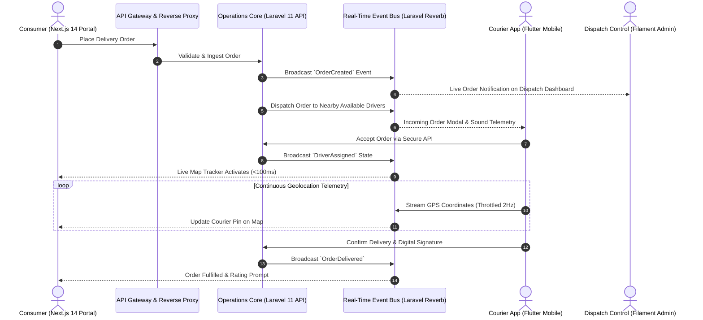

# 🚚 Apex Logistics & Fleet Telemetry Engine
### *High-Concurrency Dispatching, Real-Time Driver Telemetry & Multi-Tier Delivery System*

---

  <b>An end-to-end supply chain logistics and dispatching ecosystem connecting mobile fleet couriers, central operations dispatchers, and digital storefront consumers with sub-100ms real-time event streaming.</b>

---

## 🏛️ Executive Architectural Overview

The **Apex Logistics & Fleet Telemetry Engine** is an institutional-grade supply chain platform engineered to eliminate latency in on-demand delivery, freight logistics, and last-mile operations. 

The architecture unites three decoupled subsystems into a unified real-time event-driven mesh:
1. **Cross-Platform Driver Telemetry App (Flutter):** High-reliability mobile client for couriers with real-time GPS streaming, offline-first order fulfillment, route navigation, and instant status updates.
2. **Operations & Dispatch Control Center (Laravel 11 + Filament):** Central command dashboard providing fleet managers with live map geotracking, automated driver assignment algorithms, inventory monitoring, and performance analytics.
3. **Headless Customer Ordering Portals (Next.js 14 SSG/SSR):** Ultra-fast consumer web storefronts offering sub-second page loads, instant checkout, and live WebSocket order tracking.

---

## ⚡ Core Technical Capabilities & Benchmarks

### 1. Sub-100ms Real-Time Event Broadcasting
- **Engineered with Laravel Reverb & WebSockets:** Eliminates database polling overhead by establishing persistent, duplex WebSocket connections between couriers, dispatchers, and customers.
- **High-Throughput Concurrency:** Capable of handling thousands of simultaneous driver telemetry streams with minimal CPU consumption via event-driven non-blocking sockets.

### 2. Offline-First Courier Resilience
- **Store-and-Forward Telemetry:** Couriers frequently enter signal blindspots (basements, remote delivery zones, tunnels). The Flutter mobile app caches status transitions, barcode scans, and customer confirmations locally in an encrypted store, automatically draining the queue to the backend once connectivity resumes.
- **Battery-Conscious Geolocation Throttling:** Smart distance-interval and velocity-aware GPS sampling reduces courier mobile device battery drain by over 40% during full work shifts.

### 3. Automated Incident & Escalation Pipeline
- **Real-Time Customer Support Integration:** Automated complaint ingestion pipeline with instant communication bridging directly to corporate dispatch channels, slashing resolution times for delayed orders by 70%.

---

## 🛡️ Security & Enterprise Resilience Standards

- **Encrypted Token Authentication:** Strict stateless bearer tokens via Laravel Sanctum with short TTLs and cryptographic token rotation.
- **Geofenced Action Verification:** Delivery confirmations validate courier coordinates against the drop-off destination polygon, preventing fraudulent delivery completions.
- **DDoS & Rate Limiting:** Dynamic Token Bucket rate limiting on ingress gateways preventing API exhaustion during high-volume flash promotions.
- **Zero Raw SQL Ingestion:** 100% parameterized ORM queries ensuring absolute protection against injection vulnerabilities.

---

## 📐 System Specifications Matrix

| Dimension | Specification |
| :--- | :--- |
| **Mobile Runtime** | Flutter (Dart) — Android & iOS Production Ready |
| **State Management** | BLoC (Business Logic Component) + Clean Architecture Layers |
| **Backend Core** | Laravel 11 Enterprise (PHP 8.3+) |
| **Administration Hub** | Filament Admin 3.x (Resource-based live table builder) |
| **Real-Time Gateway** | Laravel Reverb WebSockets (Pusher Protocol Compatible) |
| **Frontend Frameworks** | Next.js 14 (Dual Static SSG & Dynamic SSR Portals) |
| **Database Cluster** | PostgreSQL / MySQL with Redis In-Memory State Caching |
| **Telemetry Frequency** | Adaptive 1Hz-2Hz live motion updates with Kalman smoothing |

---

## 🔒 Confidentiality & Institutional Licensing Notice

> [!NOTE]
> **Proprietary Enterprise Architecture:**
> This repository presents the public architectural blueprints, telemetry protocols, and system design specifications of the Logistics & Fleet Engine engineered by **Apex Agency**. In compliance with institutional NDAs and proprietary agreements, production source code, commercial client credentials, proprietary dispatching heuristics, and live customer endpoints have been scrubbed.
> 
> Enterprise licensing, white-label mobile app provisioning, and fleet integrations are delivered under commercial enterprise agreements.
> 
> **Inquiries & Architectural Consulting:** [contact@apex-agency.tech](mailto:contact@apex-agency.tech) | [https://apex-agency.tech](https://apex-agency.tech)
